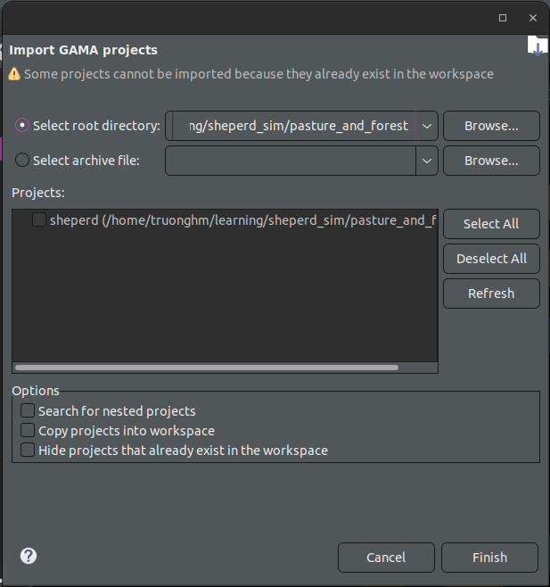

# GAMA Modelling and Simulation: Pasture and Forest

## Set up

1. Clone the repository

```bash
git@github.com:ssjinkaido/FinalGamaProject.git
```

2. Import the project into GAMA

In order to run the model, the user needs to have the GAMA Platform installed. The model is implemented in GAML, which is the language used by GAMA. The user can run the model by using the `Import > GAMA Project` feature in GAMA, and then selecting the `pasture_and_forest` directory at the project root as shown below:



3. Run the model

## Report

The report for this prorject is available at [report/report.pdf](report/report.pdf).